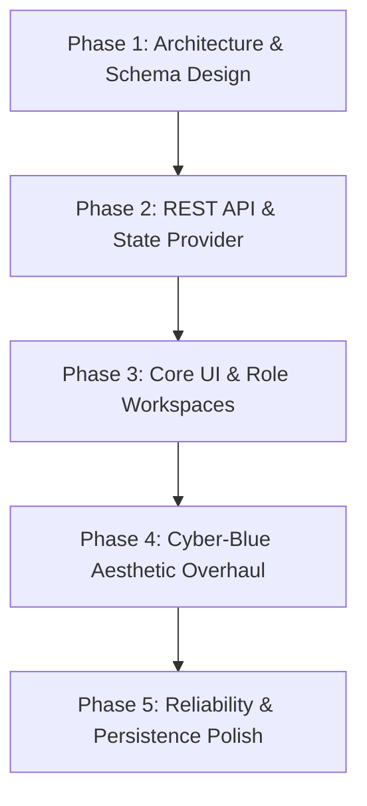

<div align="center">

# 🛡️ Next-Gen Insurance Management Platform

[](https://git.io/typing-svg)

<p align="center">
  
  
  
  
  
  
  
  
</p>

<br />

<a href="https://insuranceplatform-rho.vercel.app/" target="_blank">
  
</a>

<p align="center">
  <a href="https://insuranceplatform-rho.vercel.app/" target="_blank">
    
  </a>
  <a href="https://insuranceplatform-fjsjwrsm5-chiranjeeb-dash-gits-projects.vercel.app/" target="_blank">
    
  </a>
  <a href="https://insurance-management-platform-t560.onrender.com" target="_blank">
    
  </a>
</p>

<p align="center">
  <b>A comprehensive, state-of-the-art web platform engineered to digitize, streamline, and elevate insurance operations for Administrators, Agents, and Policyholders.</b>
</p>

---

</div>

## 📑 Table of Contents
1. [🌐 Live Cloud Demo & Access](#-live-cloud-demo--access)
2. [🌟 Introduction & Overview](#-introduction--overview)
3. [🛠️ Tech Stack & Architecture](#-tech-stack--architecture)
4. [✨ Key Features & Role-Based Workspaces](#-key-features--role-based-workspaces)
5. [🎨 Cyber-Blue Design System & UI/UX Evolution](#-cyber-blue-design-system--uiux-evolution)
6. [🗺️ Development Process: How I Built This](#-development-process-how-i-built-this)
7. [🚧 Challenges Faced & How I Overcame Them](#-challenges-faced--how-i-overcame-them)
8. [🚀 Installation & Getting Started](#-installation--getting-started)
9. [🔮 Future Roadmap](#-future-roadmap)
10. [🤝 Contributing & License](#-contributing--license)
11. [🏁 Conclusion](#-conclusion)

---

## 🌐 Live Cloud Demo & Access

Experience the full Cyber-Blue Insurance Management Platform directly in your browser without local setup:

* 🚀 **Primary Vercel Production Portal:** [https://insuranceplatform-rho.vercel.app/](https://insuranceplatform-rho.vercel.app/)
* 🔗 **Project Preview Portal:** [https://insuranceplatform-fjsjwrsm5-chiranjeeb-dash-gits-projects.vercel.app/](https://insuranceplatform-fjsjwrsm5-chiranjeeb-dash-gits-projects.vercel.app/)
* ☁️ **Live Cloud Backend API (Render):** [https://insurance-management-platform-t560.onrender.com](https://insurance-management-platform-t560.onrender.com)

> [!TIP]
> **Instant Demo Access:** The interactive login screen features 1-click quick-fill buttons allowing you to jump between **👑 Administrator**, **👔 Agent**, and **👤 Customer** workspaces instantly!

---

## 🌟 Introduction & Overview

The **Insurance Management Platform** is a modern, enterprise-grade web application designed to replace cumbersome, legacy insurance workflows with an intuitive, real-time digital ecosystem. Traditional insurance systems suffer from fragmented data, sluggish claims processing, and uninspired user interfaces. 

This platform bridges the gap by uniting **three distinct user personas**—**Administrators**, **Insurance Agents**, and **Customers**—into a single, secure, and visually stunning dashboard. From real-time KPI analytics and automated policy underwriting to instant claim submission and fraud verification checklists, every interaction is crafted for maximum speed, clarity, and aesthetic excellence.

---

## 🛠️ Tech Stack & Architecture

The application is built on a high-performance **full-stack JavaScript/TypeScript architecture** utilizing cutting-edge tools and best practices:

### 🖥️ Frontend Architecture
* **React 19 & Vite:** Next-generation component rendering with lightning-fast Hot Module Replacement (HMR) and optimized production bundling.
* **Tailwind CSS (Vanilla Custom Design Tokens):** Utility-first styling supercharged with bespoke HSL color variables, custom glassmorphism utilities, and deep cyber-ocean gradient maps.
* **Recharts:** Responsive, declarative data visualizations featuring custom SVG neon linear-gradients, glowing trend lines, and dark-mode glassmorphic tooltips.
* **Context API (`InsuranceContext`):** Zero-latency global state management synchronizing active users, policies, live claims, and real-time toast notifications across all components.

### ⚙️ Backend Architecture
* **Node.js & Express.js:** Lightweight, RESTful API server handling robust CRUD operations, role-based middleware, and document export services.
* **Prisma ORM:** Type-safe database modeling with automated schema migrations and efficient relational queries.
* **SQLite / Relational DB:** Embedded SQL persistence layer with intelligent idempotent auto-seeding engines to ensure zero data loss during restarts.
* **PDF & CSV Export Engines:** On-demand generation of formatted policy certificates, billing receipts, and multi-tier business intelligence reports.

---

## ✨ Key Features & Role-Based Workspaces

<div align="center">

| 👑 Administrator Portal | 👔 Agent Workspace | 👤 Customer Portal |
| :---: | :---: | :---: |
| **Enterprise BI Analytics** | **Instant Policy Issuance** | **Real-Time Policy Tracking** |
| **Global Claims Oversight** | **Fraud Verification Checklist** | **Instant Claim Filing Modal** |
| **User & Role Governance** | **Customer Audit Histories** | **1-Click PDF Receipt Downloads** |

</div>

### 1. 👑 Administrator Portal
* **Business Performance Dashboard:** Real-time metrics tracking Total Premium Collections, Active Policies, Pending Claims, and Month-over-Month Customer Growth.
* **Interactive Visualizations:** Deep cyber-themed ComposedCharts displaying historical revenue trajectories alongside claim volume histograms.
* **Exportable Intelligence:** 1-click export of platform analytics to structured `.CSV` spreadsheets or official `.PDF` executive reports.

### 2. 👔 Agent Workspace
* **Adjudication & Verdict Workspace:** Dedicated review dashboards for incoming customer claims, complete with police report matching, damage assessment toggles, and internal adjuster notes.
* **Policy Lifecycle Management:** Rapid underwriting tools allowing agents to issue **Auto**, **Life**, and **Home** policies with customized coverage limits and monthly premium schedules.
* **360° Customer Profiles:** Comprehensive interaction histories showing past policy renewals, claims frequency, and payment reliability.

### 3. 👤 Customer Portal
* **Active Coverage Cards:** Vibrant, gradient-coded policy cards (Ocean Blue for Auto, Deep Sky for Home) with live countdowns to policy renewal.
* **Frictionless Claim Filing:** A streamlined modal interface allowing customers to report incidents, specify damage estimates, and attach supporting documentation in seconds.
* **Document Vault:** Immediate access to downloadable policy certificates and tax-ready payment receipts.

---

## 🎨 Cyber-Blue Design System & UI/UX Evolution

A core philosophy of this project is that **enterprise software should be breathtaking to use**. Standard corporate dashboards often look flat and uninspired. We transformed this application using a bespoke **Cyber-Blue & Ocean Gradient Design System**:

1. **Rich Hero Banners:** Every major page is headlined by a deep gradient banner (`from-[#0b1329] via-[#101c38] to-[#0a1931]`) accented with glowing light-blooms, watermark background icons, and neon border highlights.
2. **Glassmorphism & Neon Indicators:** Sidebar navigation tabs feature cyan neon glowing bars upon selection (`shadow-[0_0_15px_rgba(0,216,255,0.5)]`), while status pills (`Approved`, `In Review`, `Rejected`) utilize translucent background fills with backdrop blurs.
3. **Micro-Animations:** Interactive buttons and KPI cards scale smoothly on hover (`hover:scale-[1.02]`) and provide tactile feedback on click (`active:scale-95`).
4. **Ergonomic Viewport Routing:** Automatic scroll-to-top synchronization guarantees that navigating between complex tables or opening deep adjuster reports always aligns the viewport cleanly to line zero.

---

## 🗺️ Development Process: How I Built This

The development followed a disciplined, 5-phase engineering lifecycle:



* **Phase 1: Schema & Architecture:** Defined relational models in Prisma (`Customer`, `Policy`, `Claim`, `Payment`) with strict foreign key constraints and realistic default seeds.
* **Phase 2: API & State Synchronization:** Built Express REST endpoints and wrapped the React frontend in a unified `InsuranceContext` provider to eliminate prop-drilling and ensure instant UI reactivity.
* **Phase 3: Role-Based Workspaces:** Crafted the distinct views for Customers, Agents, and Administrators, ensuring proper segregation of duties and intuitive navigation paths.
* **Phase 4: Aesthetic Overhaul:** Systematically upgraded all standard UI components into vibrant Cyber-Blue cards, custom gradient SVG charts, and illuminated navigation bars.
* **Phase 5: Hardening & Polish:** Resolved persistence gotchas, implemented automatic viewport scroll-resets, and validated cross-browser responsiveness.

---

## 🚧 Challenges Faced & How I Overcame Them

Building a complex, real-time insurance platform presented several interesting technical hurdles. Here is an authentic log of the major challenges and their systematic resolutions:

### ❌ Challenge 1: Ephemeral Data & Database Wiping on Server Restart
* **The Problem:** During development, restarting the Node/Express server would occasionally re-initialize the database or leave tables empty, causing user-created policies and claims to vanish (`"no customers no data?"`).
* **The Solution:** Engineered an **Idempotent Database Auto-Seeding Engine** (`autoSeedIfEmpty()`) inside `server.js`. On startup, the server inspects the database record count. If (and only if) the database is completely empty, it silently imports a robust baseline seed from `seed.js`. If user data exists, it preserves all records intact.

### ❌ Challenge 2: Vite Proxy Interception & HTML Error Payloads
* **The Problem:** When API endpoints encountered syntax errors or missing route handlers, Express would return default HTML error pages. The frontend `fetch` parsers expected JSON, resulting in confusing `Unexpected token '<', "<html>..." is not valid JSON` runtime exceptions.
* **The Solution:** Implemented a **Global JSON Error Handling Middleware** at the base of the Express server. It traps all unhandled exceptions and routing failures, formatting them into standardized JSON responses (`{ error: true, message: "..." }`) that the React frontend can gracefully display via Toast notifications.

### ❌ Challenge 3: Single Page Application (SPA) Scroll Retention
* **The Problem:** When users navigated from a long scrolling table (like Policy Management) to a detail view or switched dashboard tabs, the browser scrollbar remained at the bottom of the page, forcing users to manually scroll back up.
* **The Solution:** Engineered a **Dual-Layer Scroll Synchronization System**:
  1. In `App.jsx`, attached a React `useRef` to the `<main>` scrollable container and added a `useEffect` hook listening to `[currentPath, currentRole]` transitions to instantly trigger `mainRef.current.scrollTop = 0; window.scrollTo(0, 0);`.
  2. In component detail views (such as `ClaimsApprovalPage`), added localized effects listening to active record selections (`[selectedClaimId, currentPage]`) to guarantee crisp top-of-page alignments during sub-tab toggles.

### ❌ Challenge 4: Flat Data Visualizations
* **The Problem:** Default Recharts bar and line graphs looked flat, corporate, and out of place against the modern dark theme.
* **The Solution:** Injected custom SVG `<defs>` with `<linearGradient>` tags directly into `AdminDashboard.jsx`. Replaced solid fills with cyber-cyan and indigo gradients, added neon drop-shadows to trend lines, and designed a custom dark-mode glassmorphic tooltip box.

---

## 🚀 Installation & Getting Started

Follow these simple steps to run the platform locally on your machine:

### 1️⃣ Clone the Repository
```bash
git clone https://github.com/Chiranjeeb-Dash-Git/Insurance-Management-Platform.git
cd "Insurance-Management-Platform"
```

### 2️⃣ Backend Setup & Database Initialization
```bash
cd backend
npm install

# Initialize Prisma Database and run migrations
npx prisma generate
npx prisma db push

# (Optional) Seed the database manually
node prisma/seed.js

# Start the Backend Server (Runs on Port 5000)
npm run start
```

### 3️⃣ Frontend Setup & Dev Server
Open a new terminal window:
```bash
cd frontend
npm install

# Start the Vite Development Server (Runs on Port 5173)
npm run dev
```

### 4️⃣ Access the Application
Open your browser and navigate to:
👉 **`http://localhost:5173`**

*(Note: You can easily switch between **Administrator**, **Agent**, and **Customer** personas right from the interactive login screen!)*

---

## 🔮 Future Roadmap

* 🤖 **AI-Powered Fraud Scoring:** Integrating machine learning models to automatically score incoming claims based on historical fraud indicators.
* 💬 **Automated SMS & Email Alerts:** Real-time Twilio and SendGrid integration to notify policyholders of upcoming premium due dates.
* 🌐 **Multi-Currency & Localization:** Supporting global insurance markets with dynamic currency conversion and multi-language support.

---

## 🤝 Contributing & License

Contributions, issues, and feature requests are welcome! Feel free to check the issues page if you want to contribute to this project.

**License:** Distributed under the MIT License. See `LICENSE` for more information.

---

## 🏁 Conclusion

The **Insurance Management Platform** demonstrates how modern web technologies, thoughtful architectural design, and premium UI/UX aesthetics can transform traditional, data-heavy industries. By prioritizing speed, reliability, and visual delight, this project delivers an uncompromised experience for every user in the insurance ecosystem.

<div align="center">

**Built with ❤️ and attention to detail.**

</div>
